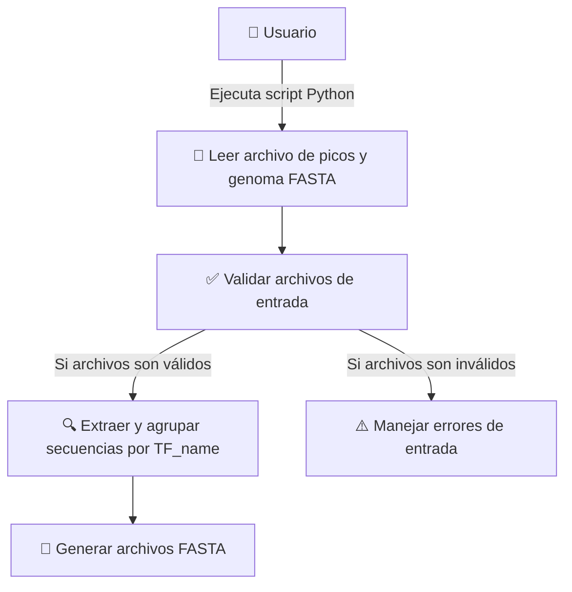

# Proyecto: Extracción de sitios de unión de unión de TF obtenidos a través de ChIP-seq en _Escherichia coli_

Fecha: 29-05-2025

Autor: 
- Ashley Yael Montiel Vargas  <yaelmont@lcg.unam.mx> 

## Descripción del Problema

### Introducción
La técnica de ChIP-seq (Chromatin Immunoprecipitation followed by Sequencing) ha revolucionado el estudio de la regulación génica al permitir la identifcación a gran escala de los sitios de unión de factores de transcripción (TFs) en el genoma. En un experimento típico, se inmunoprecipita el DNA unido a un TF de interés, se secuencia y, mediante pipelines bioinformático, se obtienen coordenadas genómicas ("picos") donde existe un enriquecimiento estadísticamente significativo de lecturas. Sin embargo, para caracterizar el motivo de unión - secuencia consenso a la cual se une el TF - es imprescindible aislar las secuencias de DNA correspondientes a pico y analizarlas y procesarlas mediante herramientas como MEME, que detectan patrones recurrentes a partir de múltiples ejemplares. 

### Justificación

-   **Escalabilidad y eficiencia.** Procesar manualmente cientos o miles de picos es laborioso y propenso a errores. Un flujo automatizado garantiza que, ante cambios en los parámetros de detección de picos o en la versión del genoma, las secuencias se extraen de forma consistente y reproducible.
    
-   **Estandarización de formatos.** Generar archivos en formato FASTA con nombres coherentes (`TF_name.fa`) facilita la integración con pipelines de descubrimiento de motivos, la anotación de regiones génicas adyacentes y la comparación entre distintas condiciones experimentales.
    
-   **Trazabilidad y auditoría.** Un script bien documentado, acompañado de registros (logs) detallados, permite rastrear qué picos se procesaron en cada ejecución, detectar coordenadas inválidas o versiones desactualizadas del genoma, y reproducir exactamente los resultados en auditorías o publicaciones.

### Alcance

Este proyecto se limita a la generación de un conjunto de archivos FASTA, uno por cada TF, con todas las secuencias de unión extraídas, así como un resumen de ejecución que detalle el número de picos procesados, TF generados y posibles incidencias, errores y davertencias, para facilitar la depuración y auditoría. 

Por lo tanto, no se abordan las fases de descubrimiento de motivos, generación de gráficos o reportes estadísticos, tampoco se incluye la automatización del análisis con MEME.

## Especificación de Requisitos


### Requisitos Funcionales:
    
1.  **Argumentos de entrada:**
   -   `--peaks` _<archivo>_: TSV/CSV con columnas mínimas `TF_name`, `Peak_start`, `Peak_end`.
    
-   `--genome` _<archivo.fa>_: referencia completa de _E. coli_ en formato FASTA.
    
-   `--outdir` _<directorio>_ (opcional): carpeta para los FASTA generados. Si no existe, se crea automáticamente.
 -   `--logs` _<directorio>_ (opcional): carpeta para el log generado. Si no se especifica, el log no se genera.
 -   `--verbose` _<store_action>_ (opcional): Permite mostrar mensajes DEBUG
 -   `--line_length` _<int>_ (opcional): Número de caracteres por línea del archivo FASTA, esta definido por default en 80 caracteres.

2. **Validaciones**

-   Comprobar que el archivo de picos contiene las columnas requeridas.
    
-   Verificar legibilidad y formato correcto del FASTA del genoma.
    
-   Informar con mensajes claros en caso de error (coordenadas inválidas, archivos faltantes, etc.).

3.  **Extracción y Procesamiento de Secuencias:**
    
 -   Leer cada fila: extraer `TF_name`, `Peak_start`, `Peak_end`.
        
    -   Para cada TF, recortar la secuencia génica de la hebra forward utilizando las coordenadas dadas.
        
    -   Agrupar todas las secuencias de un mismo `TF_name`.
      
4.  **Generación de Archivos FASTA:**
    
-   Crear un archivo `TF_name.fa` en el directorio de salida.
    
-   Escribir en él todas las secuencias extraídas, con cabeceras descriptivas (`>TF_name_peakX:start-end`).
    
-   Registrar en un log cualquier incidencia detectada (coordenada fuera de rango, duplicados…).
  
5. **Manejo de Errores**
  - El manejo de errores se puede consultar en el archivo "test_cases"
  -   Al finalizar, producir un breve resumen (por consola y/o en un archivo `summary.txt`), indicando:
   -   Total de TFs procesados.
    -   Número de secuencias extraídas por TF.    
    -   Errores y advertencias capturados.


### **Requisitos No Funcionales:**

-   **Portabilidad y Usabilidad:**
    
    -   Compatible con sistemas Unix/Linux bash + Python ≥3.8)
    -   El sistema debe ser ejecutable desde la línea de comandos.
    -   Todos los datos de entrada a los programas deben pasarse via argumentos.
    -
    
-   **Calidad y Mantenimiento:**
    
    -   Utilización de Git para el seguimiento y revisión del código.
    -   Documentación clara y comentarios efectivos deben acompañar todo el proyecto (PEP8, docstrings, typing)
    -   Deben realizarse pruebas las pruebas necesarias para la validación correcta del software.
    - Logs y excepciones: manejo robusto de errores, con registro en archivo de log.


### C. Descripción de Datos de Entrada y Salida 

#### Formato del Archivo de Picos

Este archivo contiene información crucial sobre las regiones de unión de los 139 factores de transcripción (TFs) en _Escherichia coli_. Los datos están organizados en columnas que permiten identificar detalles específicos sobre la unión de los TFs a lo largo del genoma. El formato del archivo y la descripción de cada columna se detallan a continuación:

-   **Dataset_Ids:**
    
    -   _Descripción:_ Identificadores únicos para cada conjunto de datos. Estas IDs indican diferentes experimentos o condiciones bajo las cuales se determinaron los sitios de unión para los TFs.
    -   _Ejemplo:_ "DS001","DS002", etc.
-   **TF_name:**
    
    -   _Descripción:_ El nombre del factor de transcripción que se une al genoma en la región especificada.
    -   _Ejemplo:_ "AraC", "LacI", etc.
-   **Peak_start:**
    
    -   _Descripción:_ La posición inicial en el genoma donde comienza el pico de unión. Se refiere a la ubicación del primer nucleótido del pico.
    -   _Ejemplo:_ 345676, 123456, etc.
-   **Peak_end:**
    
    -   _Descripción:_ La posición final en el genoma donde termina el pico de unión. Se refiere a la ubicación del último nucleótido del pico.
    -   _Ejemplo:_ 345786, 123556, etc.
-   **Peak_center:**
    
    -   _Descripción:_ Posición central del pico de unión, calculada como el promedio o posición entre el `Peak_start` y `Peak_end`.
    -   _Ejemplo:_ 345731, 123501, etc.
-   **Peak_number:**
    
    -   _Descripción:_ Número secuencial utilizado para identificar picos dentro de un conjunto de datos. Esto es útil para referencias internas.
    -   _Ejemplo:_ 1, 2, 3, etc.
-   **Max_Fold_Enrichment:**
    
    -   _Descripción:_ Valor que representa el máximo enriquecimiento observado en el sitio de unión del pico.
    -   _Ejemplo:_ 15.4, 22.3, etc.
-   **Max_Norm_Fold_Enrichment:**
    
    -   _Descripción:_ Valor de máximo enriquecimiento normalizado, ajustado por un factor de control para comparaciones equitativas entre experimentos.
    -   _Ejemplo:_ 12.0, 20.1, etc.
-   **Proximal_genes:**
    
    -   _Descripción:_ Lista de genes cercanos al pico de unión, proporcionando contexto para el análisis funcional.
    -   _Ejemplo:_ "geneA, geneB", "geneX, geneY", etc.
-   **Center_position_type:**
    
    -   _Descripción:_ Denota la ubicación genómica del pico central, como intergénica, intrónica, etc.
    -   _Ejemplo:_ "intergénica", "intrónica", etc.


## Análisis y Diseño

**Objetivo:** Extraer las secuencias genómicas correspondientes a los picos de unión de los TFS y generar archivos FASTA individuales para cada `TF_name`.

**Flujo de Trabajo:**

1.  **Lectura de Entradas:**
    
    -   Cargar el archivo de picos y el archivo FASTA del genoma.
       - Verificar que los archivos estén correctamente formateados
    -   Obtener el directorio de salida desde la línea de comandos.
       - Verificar que el directorio de salida exista, si no exites crear uno
    
2.  **Procesamiento de Datos:**
    
    -   Leer cada fila del archivo de picos.
    -   Extraer los campos `TF_name`, `Peak_start`, `Peak_end` para cada entrada.
    -   Para cada `TF_name`, usar las posiciones `Peak_start` y `Peak_end` para extraer la secuencia correspondiente del archivo FASTA del genoma.
  
   
3.  **Generación de FASTA:**
    
    -   Agrupar las secuencias extraídas por `TF_name`.
    -   Crear un archivo FASTA por cada `TF_name` en el directorio de salida con la misma estructura `<TF_name>.fa`.
    -   Si no se puedo registrar la advertencia/error

4. **Manejo de errores**
    - Capturar y registrar errores y advertencias en un archivo de log.
    - Generar un reporte al final de la ejecución


**Algoritmo**

```
1. Inicio
2. Parsear argumentos: peaks , genome, outdir, logs, line_length, verbose
3. Leer y validar el genoma
4. Leer y validar el archivo de picos
5. Para cada línea en peaks_file:
   a. Extrarer TF_name, Peak_start, Peak_end
   b. Si las coordenadas son válidas:
      i. Extraer secuencia del genoma usando Peak_start y Peak_end
      ii. Agrupar secuencias por TF_name
   c. Si no:
      i. Registrar advertencia en el archivo de log
7. Por cada TF_name:
   a. Si hay secuencias válidas:
      i. Crear archivo FASTA
      ii. Escribir secuencias en archivo con cabecera descriptiva
   b. Si no:
      i. Registrar advertencia en el archivo de log
8. Generar reporte de ejecución
9. Fin
```

### Diagrama de Caso de Uso (PlantUML) para Visualizar el Proceso:

Usar un editor para visualizar el diagrama <https://sujoyu.github.io/plantuml-previewer/>

```
@startuml
actor "Usuario" as usuario

rectangle "Sistema de Extracción y Creación de FASTA (Python)" {
    usecase "Leer archivo de picos y genoma FASTA" as UC1
    usecase "Validar archivos de entrada" as UC1.1
    usecase "Extraer y agrupar secuencias por TF_name" as UC2
    usecase "Generar archivos FASTA" as UC3
    usecase "Manejar errores de entrada" as UC4
}


usuario --> UC1 : Ejecuta script Python
UC1 --> UC1.1 : Valida archivos
UC1.1 --> UC2 : Si archivos son válidos
UC2 --> UC3 : Guarda archivos FASTA
UC1.1 --> UC4 : Si archivos son inválido

@enduml
```




